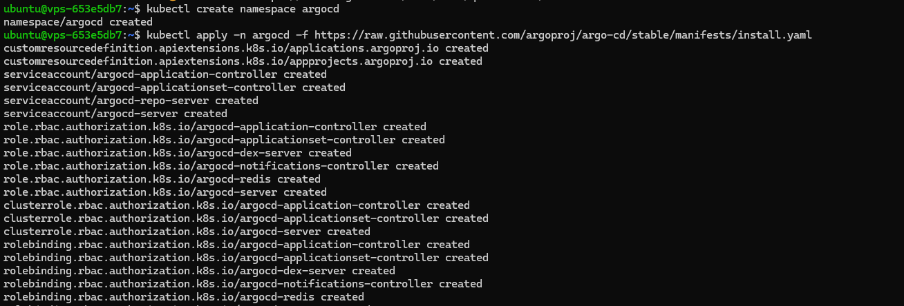

# TP5: Déploiement d'Applications avec Helm, Charts et ArgoCD

## Objectifs

Les objectifs de ce TP sont :

- Comprendre l’utilisation de Helm pour gérer les déploiements Kubernetes.
- Créer des Helm Charts pour l’application MERN.
- Installer et configurer ArgoCD pour le déploiement continu.
- Déployer l’application MERN en utilisant ArgoCD avec des packages provenant d’un dépôt Git.

## Prérequis

- Avoir réalisé le TP précédent sur le déploiement avec Kubernetes.
- Disposer d’un cluster Kubernetes fonctionnel (Docker Desktop ou Minikube).
- Avoir les outils kubectl, helm et docker installés et configurés.
- Compte GitHub ou GitLab pour héberger les Helm Charts.

## 1. Installation de Helm

### Vérification de l’installation

Assurez-vous que Helm est installé en vérifiant la version :

```bash
helm version
```

### Screenshot


## 2. Création des Charts Helm pour l’application MERN

### 2.1. Structure des répertoires

Créez un répertoire pour vos charts Helm :

```bash
mkdir mern-charts
cd mern-charts
```


### 2.2. Création du Chart pour MongoDB

Créez le chart pour MongoDB :

```bash
helm create mongodb
```


Modifiez le fichier `mongodb/values.yaml` pour adapter le chart à MongoDB :

```yaml
replicaCount: 1
image:
  repository: mongo
  tag: latest
  pullPolicy: IfNotPresent
service:
  type: ClusterIP
  port: 27017
ingress:
  enabled: false
```


### 2.3. Création du Chart pour le serveur

Créez le chart pour le serveur :

```bash
helm create server
```


Modifiez le fichier `server/values.yaml` pour le serveur :

```yaml
replicaCount: 3
image:
  repository: [username]/mern-server
  tag: latest
  pullPolicy: IfNotPresent
service:
  type: ClusterIP
  port: 5000
env:
  - name: MONGO_URI
    value: mongodb://mongodb:27017/mern-app
  - name: PORT
    value: "5000"
ingress:
  enabled: false
```


Remplacez `[username]` par votre nom d’utilisateur Docker Hub.

### 2.4. Création du Chart pour le client

Créez le chart pour le client :

```bash
helm create client
```


Modifiez le fichier `client/values.yaml` pour le client :

```yaml
replicaCount: 3
image:
  repository: [username]/mern-client
  tag: latest
  pullPolicy: IfNotPresent
service:
  type: ClusterIP
  port: 3000
env:
  - name: REACT_APP_SERVER_URL
    value: http://server:5000
ingress:
  enabled: true
  annotations: {}
  hosts:
    - host: mern-app.local
      paths:
        - path: /
  tls: []
```


## 3. Hébergement des Charts Helm dans un Dépôt Git

### 3.1. Initialisation du Dépôt Git

Initialisez votre dépôt Git :

```bash
cd ../
git init
git add mern-charts/
git commit -m "Ajout des charts Helm"
```


### 3.2. Création du Dépôt Distant

Sur GitHub ou GitLab, créez un nouveau dépôt (privé ou public selon vos préférences).

### 3.3. Lien avec le Dépôt Local

Liez votre dépôt local avec le dépôt distant :

```bash
git remote add origin [URL_DU_DEPOT_GIT]
git branch -M main
git push -u origin main
```


## 4. Installation d’ArgoCD et Accès à l’Interface

### 4.1. Installation d’ArgoCD dans le Cluster Kubernetes

Créez un namespace dédié pour ArgoCD :

```bash
kubectl create namespace argocd
```

Installez ArgoCD en appliquant les manifestes officiels :

```bash
kubectl apply -n argocd -f https://raw.githubusercontent.com/argoproj/argo-cd/stable/manifests/install.yaml
```



Vérifiez que les pods d’ArgoCD sont en cours d’exécution :

```bash
kubectl get pods -n argocd
```


### 4.2. Configuration de l’Accès à l’Interface Web d’ArgoCD

Pour Docker Desktop et Minikube, configurez le port forwarding pour le service `argocd-server` :

```bash
kubectl port-forward svc/argocd-server -n argocd 8080:443
```

Laissez cette commande s’exécuter dans un terminal pour maintenir le port forwarding actif.

### 4.3. Accès à l’Interface Web

Accédez à ArgoCD via le navigateur à l’adresse : `https://localhost:8080`.


### 4.4. Récupération du Mot de Passe Administrateur

Récupérez le mot de passe initial en exécutant :

```bash
kubectl -n argocd get secret argocd-initial-admin-secret -o jsonpath="{.data.password}" | base64 -d; echo
```


### 4.5. Connexion à ArgoCD

Connectez-vous à l’interface web avec le nom d’utilisateur `admin` et le mot de passe récupéré.

### 4.6. Modification du Mot de Passe Administrateur

Modifiez le mot de passe dans l’interface web sous **Settings** > **Accounts**.


## 5. Configuration d’ArgoCD pour le Déploiement de l’Application via Git

### 5.1. Ajout du Dépôt Git à ArgoCD

Dans l’interface web d’ArgoCD :

- Allez dans **Settings** > **Repositories**.
- Cliquez sur **Connect Repo using HTTPS** ou **SSH**, selon votre configuration.
- Renseignez l’URL de votre dépôt Git.
  

### 5.2. Création de l’Application dans ArgoCD

Dans ArgoCD, cliquez sur **New App** et remplissez les informations :

- **Application Name** : `mern-app`
- **Sync Policy** : `Automatic`
- **Repository URL** : L'URL de votre dépôt Git contenant les charts Helm
- **Revision** : HEAD ou une branche spécifique
- **Path** : `mern-charts/`
- **Cluster** : `https://kubernetes.default.svc`
- **Namespace** : `default`
- Cochez **Enable Helm**.

Cliquez sur **Create**.


## 6. Synchronisation et Surveillance du Déploiement

### 6.1. Vérification de l’État des Applications

Dans ArgoCD, vérifiez que l’application `mern-app` est en état **Healthy** et **Synced**.

### 6.2. Résolution des Problèmes

Si l’application est en état **OutOfSync** ou **Degraded**, cliquez dessus pour voir les détails et les événements associés.

## 7. Mise à Jour Continue avec ArgoCD

### 7.1. Modification des Charts Helm

Apportez des modifications aux charts Helm dans votre dépôt Git.

### 7.2. Poussée des Changements vers le Dépôt Git

```bash
git add .
git commit -m "Augmentation du nombre de replicas"
git push origin main
```


## Nettoyage des Ressources

Pour supprimer l’application déployée :

```bash
argocd app delete mern-app
```

Pour désinstaller ArgoCD :

```bash
kubectl delete namespace argocd
```


